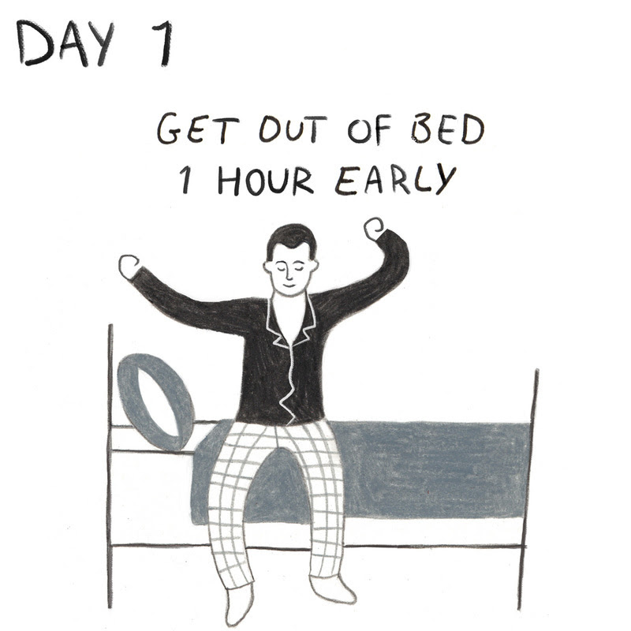

# Day 1: Get Out of Bed 1 Hour Earlier Than You Usually Do

_“On those mornings you struggle with getting up, keep this thought in mind—I am awakening to the work of a human being. Why then am I annoyed that I am going to do what I’m made for, the very things for which I was put into this world? Or was I made for this, to snuggle under the covers and keep warm? It’s so pleasurable. Were you then made for pleasure? In short, to be coddled or to exert yourself?”_ —Marcus Aurelius, Meditations, 5.1

## Short version

One of the best passages in all of Marcus Aurelius’s Meditations is the opener to Book V. In it, Marcus has a dialog with himself as he struggles to get out of bed in the morning. It’s just marvelously relatable. Here we have an extraordinary man, some twenty centuries ago, struggling just like every ordinary man and woman has, to get up the willpower to get up from his warm bed and get to work. 

Who hasn’t had a similar conversation with themselves? Who hasn’t thought, just as Marcus did, that “it’s nicer here” under the covers?

As Dante wrote in his Divine Comedy, “beneath the blanket is no way to fame.” Not that Marcus or the Stoics would have advocated chasing fame. Still, Marcus did get out of bed that morning and every other morning. Why? Because he had to. He had a job to do. We all do. Ordinary and extraordinary alike, we weren’t put on this planet and evolution didn’t mercilessly improve and refine our species to do nothing. No, we have skills to deploy and duties to fulfill. 

**We have things to do. It’s time to get up and do them.**

## Audio comment
[Ryan Holiday's commentary on today's challenge](https://el2.convertkit-mail.com/c/qdu3dd567t7h0v3n6/g0snh5hk3kzkx/aHR0cHM6Ly9zb3VuZGNsb3VkLmNvbS9zdG9pY2NoYWxsZW5nZS9kYXktMS9zLVREWXE2)

## Long version

The greatest enemy of forward progress is not some equal, opposing force. It is inertia. Getting started. Getting moving. Getting the ball rolling. Or like for Marcus, just plain getting up. Some days there is nothing harder than waking up and getting out of bed...which is why we’re starting this challenge not just with getting out of bed, but with doing it early. 

Whatever your alarm is normally set to, move it forward sixty minutes. Treat it like a command for the morning. And more important, do it with a smile on your face--because you’re up to do important work: Being you. That’s the resolution of that little debate Marcus had with himself 2,000 years ago. You weren’t made to live in a comfy bed. This life isn’t all about pleasure. No, you’ve got duties to fulfill and potential to realize! 

In his epic poem, Dante wrote that “Beneath the blanket is no way to fame,” and he was right. You can’t accomplish anything while you’re still curled up under the covers, allowing the resistance of inertia to wrap you in excuses. No one becomes their best self repeatedly hitting the snooze button. No one carpe’s the diem by waiting until the last possible second to get up. Nobody’s morning routine is more productive the more frenzied it must become. 

In many ways, as Shane Parrish has written, the best productivity advice on the planet is to get up early. You do your best work while the day is young. There are fewer distractions in the morning--the emails haven’t come in yet, the phone isn’t ringing, the kids aren’t fighting or dragging their feet or demanding your attention. There’s less traffic too. Eugen Herrigel writes in The Method of Zen that for archery and swordsmanship, “the early hours of morning are chosen for practice, when one is clear headed.” You can (and should) apply the same discipline to whatever craft you are pursuing. 

Get up. Get practicing. The quiet peace of the morning is yours. Take it. Use it. 

Waking up early isn’t just about increasing productivity. It’s about book-ending your sleep as part of a routine in order to increase its quality. People sleep better when they’re on a schedule. Just as waiting to go to bed until the TV has overloaded every last one of your eyes’ rods and cones is a recipe for fitful sleep, only getting out of bed when you have to, or when you feel like it, at last as you can get away with that specific day, means you have already tossed out the possibility of a well-ordered, efficient routine. You have agreed to a chaotic, reactive day, in some cases, before the sun has even come out. Is that really your best life? Is that what Marcus Aurelius would have wanted for himself or for you? 

No one is saying you have to join Jocko Willink’s 430AM Club but there is something special about starting the day off with a win and with discipline. We could say that waking up earlier than necessary is a form of voluntary discomfort. Seneca talks about toughening up the soul in good times so that we are fortified against the demands of bad times. The person who can build up more good habits--beginning with something as simple as waking up early--is more prepared for other difficulties than someone who has built up fewer good habits; or worse, more bad habits. The person who has developed to command their body “Rise!” at an arbitrary time each day is going to be strong enough to tell their body “No!” when it wants to take shortcuts or indulge diversions into harmful tendencies. Think about this habit of getting up earlier then not just as a productivity tool but as a kind of muscle building exercise. 

“Early to bed and early to rise makes a man healthy, wealthy and wise,” was Ben Franklin’s line, and as always he’s totally right. Yet his wisdom does not end there. His advice on preparation--”an ounce of prevention is worth a pound of cure”--applies here too. Getting out of bed early doesn’t have to be a matter of sheer willpower, if you do all the right stuff before you get into bed the night before. 

Going to bed earlier helps. So does using your bed only for sleeping and for sex. Take the TV out of your bedroom. Don’t let your laptop or your phone or even your books cross the threshold. Teach your body that your bed is not there to distract your mind, but rather to quiet and recharge it, and it will be easier to get out of it when the alarm goes off eight hours later. Keep your room at the right temperature. Wind down before bed, don’t just expect to magically fall asleep when three seconds earlier you were staring at the bright, blue light of your phone or tablet screen. (Expert Level Stoicism: Marcus supposedly slept on a hard mattress to toughen himself up)

As for getting out of bed, tell yourself that the snooze button doesn’t exist. Act like you’ve got an early flight each morning--you can’t afford to take it slow or get distracted. You’ve got to get up at the first sound and get moving. And the truth is you do have something you can’t afford to miss. The quiet reflective time in the morning should be non-negotiable. It’s way more important than a flight or a business appointment. 

Here are some great resources for tracking and improving your sleep:

1. [Sleepyti.me](https://el2.convertkit-mail.com/c/qdu3dd567t7h0v3n6/z4ighnh838d83/aHR0cHM6Ly9zbGVlcHl0aS5tZS8=) - Plug in the time you have to wake up and Sleepyti.me will tell you the optimal time to go to sleep, based on the [90-Minute Rule](https://el2.convertkit-mail.com/c/qdu3dd567t7h0v3n6/xvfph6hlwl7le/aHR0cHM6Ly93d3cubGlmZWhhY2sub3JnL2FydGljbGVzL2xpZmVzdHlsZS85MC1taW51dGVzLXNsZWVwLWN5Y2xlLmh0bWw=)

2. Turn your phone to [Grayscale](https://el2.convertkit-mail.com/c/qdu3dd567t7h0v3n6/ketmh6h3l3936/aHR0cHM6Ly9saWZlaGFja2VyLmNvbS9jaGFuZ2UteW91ci1zY3JlZW4tdG8tZ3JheXNjYWxlLXRvLWNvbWJhdC1waG9uZS1hZGRpY3RpLTE3OTU4MjE4NDM=) or dim your computer screen using [f.lux](https://el2.convertkit-mail.com/c/qdu3dd567t7h0v3n6/26c2hohe2eoed/aHR0cHM6Ly9qdXN0Z2V0Zmx1eC5jb20v) - Research shows blue light from phones, computers, and TVs keeps you awake by suppressing the production of melatonin.

3. Set a Bedtime Alarm - Alarms aren’t just for waking up but also for going to bed. Creating a friendly reminder might help you in getting to bed earlier.

4. MedHelp’s free sleep tracker - “track your sleep patterns, and identify patterns of behavior that result in better or more restless sleep, from drinking warm milk to uncomfortable temperatures.”

5. Sleep with white noise or natural sounds - it reduces the potential to be awakened by unwanted sounds. Or pick some music that you can zone out to and associate with sleep and use that each night. 

6. The Economics of Sleep from the Freakonomics podcast 
Part 1: “Could a lack of sleep help explain why some people get much sicker than others?”
Part 2: “People who sleep better earn more money. Now all we have to do is teach everyone to sleep better.

7. The "Swiss Army Knife" Of Health: A Good Night's Sleep from NPR

8. Why We Sleep: Unlocking the Power of Sleep and Dreams by Matthew Walker, PhD - neuroscientist and "sleep scientist" Matthew Walker uncovers the science of sleep and how we can harness its transformative power to change our lives for the better.

9. How To Fall Asleep in 2 Minutes or Less and 22 Ways to Get a Better Night’s Sleep from The Art of Manliness

**So c’mon. Get in the shower, have your coffee, and let’s get going.**

_Although this is just the first day’s challenge, we encourage you to wake up earlier for all 30 days, helping you develop a positive routine. Each day’s challenge is designed to help build habits. While not all may fit with your daily routine, we encourage keeping with as many of them as you can over the next 30 days._
