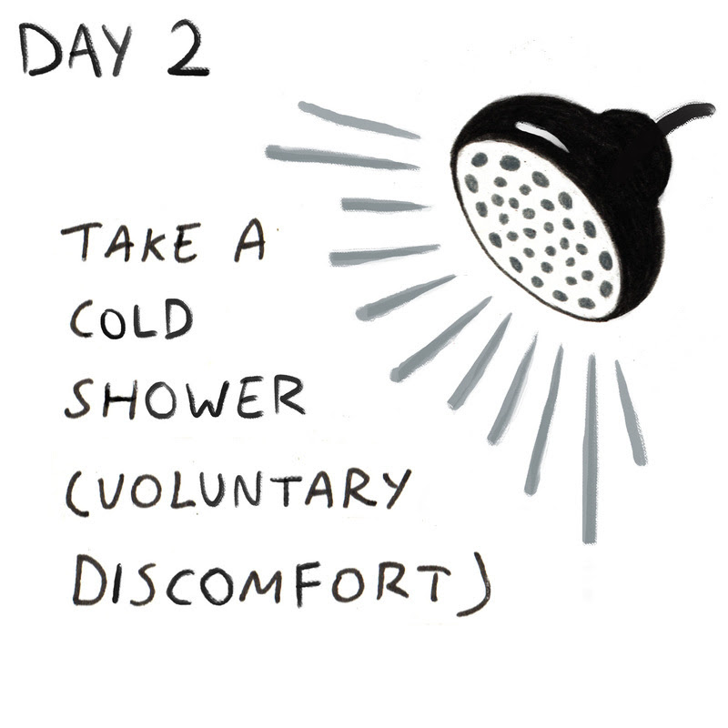

# Day 2: Voluntary Discomfort (Take a Cold Shower)

_“I expose myself to a lot of duress and pain in, say, the form of ice baths and cold exposure simply to develop my tolerance for the then unavoidable pain and disruption that comes to all of us. The more you schedule and practice discomfort deliberately, the less unplanned discomfort will throw off your life and control your life.”_ -- Kevin Rose

## Short version

As you’ll come to see in the days to follow, the Stoic seeks out opportunities to practice voluntary discomfort. They do this, not because they are crazy, but because they realize that life is completely indifferent to our preferences. It does not care about creature comforts. The person who gets familiar with cold showers lives in less fear of their gas getting turned off than the one who isn’t. The person who can brave the cold water with enthusiasm will be more prepared for other inconveniences of daily life and will be stronger in the face of unpleasant obligations. 

**Life is short. We have important things to do today. Don’t waste a second waiting for the water to warm up. Dive right in. Be the person with the purpose strong enough to choose a cold shower and the will enduring enough to get through it.**

## Audio comment
[Ryan Holiday's commentary on today's challenge](https://soundcloud.com/stoicchallenge/day-2-take-a-cold-shower-voluntary-discomfort/s-IlGNs)

## Long version

**Nothing beats a long, hot shower. Nothing beats it because...who’s fighting? It’s great. Everyone loves a hot shower. Like a warm blanket combined with a massage, the comfort of a hot shower is one of the great luxuries of the modern world. The problem is that luxuries like these can spoil us.**

That’s why today, whether it’s first thing in the morning fresh out of bed or later this afternoon after a hard workout at the gym--whenever you plan to shower today--instead of waiting like Goldilocks for your shower to warm up exactly right, you’re going to turn the knob to ‘Cold’ and step right in. Don’t wait for it to get warm...because it’s not going to. The point of this shower is shock and disquietude--to teach the body and the mind an important lesson about what life is like and who is in charge. 

This is called the practice of voluntary discomfort, where--like waking up early--you are training the mind to lead the body rather than the other way around. For most of us this will be a voyage onto virgin soil with a new captain at the helm of the ship. And we should look at it as an welcome opportunity, because we’re already familiar with how the ship runs with the other captain (the body) at the wheel, and it’s not all that it’s cracked up to be.  

Just consider: have you ever been somewhere where the water pressure was no good? Where the water heater got tapped out by the people who showered before you? How quickly this turns us into whiny children! As if just a generation or two ago people wouldn’t have killed for indoor plumbing period, at any temperature. 

Most of us live in fear of this type of inconvenience, of the slightest physical discomfort, and we become weak as a result. If you can practice pushing yourself to the point of discomfort, however, and you can maintain a positive, steady state outside your comfort zone, that’s when you begin to build resiliency. This isn’t a revolutionary notion. This is the same process by which physical endurance translates into mental endurance. If you’re more prepared to handle a wider range of potential scenarios, then everyday annoyances and inconveniences begin to feel less disruptive. And if the worst case scenario prevails—which it rarely does—it won’t leave you completely wrecked. 

But you don’t have to take our word for it. Just listen to Kevin Rose, who told us all about his experiments with cold in our Daily Stoic interview with him: 

_“Almost everyone hates the cold. When I tell friends about the showers and ice baths the #1 reaction is “I could never do that, I can’t stand the cold.” My feeling is that technology (primarily the conditioning of air, both hot and cold) has made us soft. We’re kept in constant comfort. I try to incorporate practices in my life that mimic our ancestor’s environments and their daily challenges. This can be simple things like walking in the rain without a jacket or wearing my sandals in the December snow when I take the dog out in the mornings.”_

Kevin is a data geek. He pokes and prods and measures himself on a near constant basis. He would certainly appreciate--and echo--the fact that, like with early rising, there are also a number of scientifically proven health benefits to a nice, cold shower. It can: 

- Increase alertness, focus and attention: https://www.ncbi.nlm.nih.gov/pubmed/911386
- Decrease Cortisol levels (cortisol is produced in stressful situations, at first in cold shower they may increase, but they will decrease over time. https://www.ncbi.nlm.nih.gov/pmc/articles/PMC40490...
- Treat depression: https://www.ncbi.nlm.nih.gov/pubmed/17993252
- Speed up recovery after sports: https://www.ncbi.nlm.nih.gov/pmc/articles/PMC24653...
& reduced inflammation: https://www.ncbi.nlm.nih.gov/pmc/articles/PMC46038...
- Improve immune system: https://www.ncbi.nlm.nih.gov/pmc/articles/PMC50250...
- Support weight and fat loss(in small amounts): https://www.ncbi.nlm.nih.gov/pubmed/19357405
- Increase willpower and discipline, help save time and money, improve sleep and boost happiness.
http://2be.fit/health/20-benefits-cold-showers/

So how does one actually take a cold shower? Is it just like a regular hot shower...just cold? Aubrey Marcus, the author and founder of Onnit, as well as another aspiring Stoic, talks about cold showers in his book and advises beginning with taking your usual warm shower and then once you’re done with your cleaning and grooming, turning the nozzle all the way to cold. While not quite as hardcore as we’re suggesting, this is actually a smart way to go about it if you’ve never done cold showers before and your body reacts strongly to temperature changes. Either way, the key to cold exposure is willpower. “That battle of choice turns lions into lambs, and lambs into lions every day,” Aubrey said in our interview with him. “If you are going to roar into your day, you better be able to handle a little bit of cold water.”

As you’ll come to see in the days to follow, the Stoic seeks out opportunities to practice voluntary discomfort. They do this, not because they are crazy, but because they realize that life is completely indifferent to our preferences. It does not care about creature comforts. The person who gets familiar with cold showers lives in less fear of their gas getting turned off than the one who isn’t. The person who can brave the cold water with enthusiasm will be more prepared for other inconveniences of daily life and will be stronger in the face of unpleasant obligations. 

Who doesn’t want to be that person? Would you rather be the wimp waiting naked on the bath mat repeatedly reaching into the shower like Goldilocks, demanding that everything be just right before you grace the shower with your presence?

**Life is short. We have important things to do today. Don’t waste a second waiting for the water to warm up. Dive right in. Be the person with the purpose strong enough to choose a cold shower and the will enduring enough to get through it.**