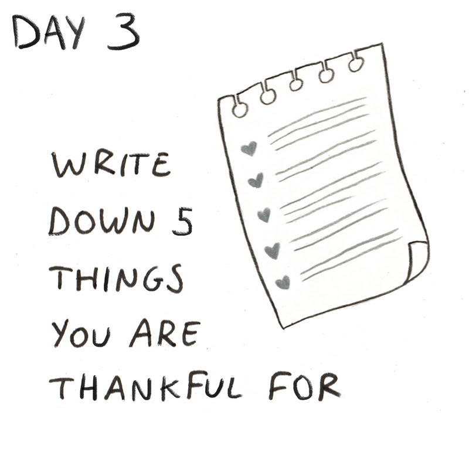

# Day 3: Write down 5 things you are thankful for

_“Gratitude is not only the greatest of virtues, but the parent of all others.”_ ― Marcus Tullius Cicero

## Short version

**Today’s Stoic challenge is to write down 5 things you are grateful for. Like actually write them out. With a pen. On a piece of paper. That you carry with you all day.**

Gratitude does not begin and end with personal appreciation for having a positive impact on our lives. Gratitude is not transactional. One obvious piece of low-hanging fruit to be grateful for is life itself. While this might sound like a cliché, your life is the product of an unbroken chain of births that lasted into adulthood long enough to procreate going back more than 125,000 generations. The number of things that had to go right for you to be here with us on earth right now, reading these words, is so immensely, improbably big that the only reasonable way to describe your existence is as a miracle. Yet here you are, not just alive, but under conditions in which there has never been a better time in history to be alive. A time when you can purchase food at a store instead of having to hunt, kill, dress, haul, and prepare it yourself. You can pursue your goals and interests, without fear of being called off to war against your will. You can reasonably expect to live to the ripe age of 70 without exceptional medical intervention to get there. Without exaggeration, if you are alive and kicking in the western world today, you have won the lottery, twice! If you need somewhere to start when it comes to gratitude, you could do worse than writing this down first.

**This is a deceptively simple challenge. But make no mistake, it can change your life in incredible and complex ways. Until you do it, and sit with it, you have no idea how powerful a shift in mindset can be. You don’t know the butterfly effect that can occur when your relationship with someone close to you changes, because your attitude changed. If the fact that you are alive today, and here now, is a bonafide miracle; then this is a legitimate superpower.**

## Audi comment
[Ryan Holiday's commentary on today's challenge](https://soundcloud.com/stoicchallenge/day-3-write-down-5-things-you-are-thankful-for/s-wApVd)

## Long version
The safety and surplus of modernity has produced in human beings a proclivity for more: fatter paychecks, nicer cars, bigger houses, louder toys. As time goes on, and the risks posed by external existential threats trend toward zero, it becomes easier for us to overlook or take for granted the good fortune we have always enjoyed. And we are missing out as a result. Scientific research has shown that regular expressions of gratitude are supremely beneficial, not just to our own well-being, but to the well-being of those around us.

That’s why today’s Stoic challenge is to write down 5 things you are grateful for. Like actually write them out. With a pen. On a piece of paper. That you carry with you all day.

The Stoics long recognized the importance of expressing gratitude. In the first book of Meditations, Marcus Aurelius underscores the importance of gratitude by acknowledging those who exuded what he considered to be the most admirable qualities. This included recognizing his grandfather for his courtesy and serenity of temper; his father for manliness without ostentation; his mother for piety and generosity; his tutor for instilling a positive work ethic; the gods for surrounding him with good people, to name just a notable few. All of these characters had a major influence on Marcus Aurelius’s life, and he gave them appropriate thanks for serving as a proper model of emulation.

Gratitude does not begin and end with personal appreciation for having a positive impact on our lives. Gratitude is not transactional. One obvious piece of low-hanging fruit to be grateful for is life itself. While this might sound like a cliché, your life is the product of an unbroken chain of births that lasted into adulthood long enough to procreate going back more than 125,000 generations. The number of things that had to go right for you to be here with us on earth right now, reading these words, is so immensely, improbably big that the only reasonable way to describe your existence is as a miracle. Yet here you are, not just alive, but under conditions in which there has never been a better time in history to be alive. A time when you can purchase food at a store instead of having to hunt, kill, dress, haul, and prepare it yourself. You can pursue your goals and interests, without fear of being called off to war against your will. You can reasonably expect to live to the ripe age of 70 without exceptional medical intervention to get there. Without exaggeration, if you are alive and kicking in the western world today, you have won the lottery, twice! If you need somewhere to start when it comes to gratitude, you could do worse than writing this down first.

But we urge you to really challenge yourself today as you look for things to be grateful for. It’s all too easy to be thankful for the good fortunes the universe happens to bestow upon us. For the objects of children’s bedtime prayers--friends, family, grandma, grandpa, the dog and the cat. The true test of Stoic character is to be grateful for adversity, even in the face of trial and hardship. To borrow from the wisdom of Marcus Aurelius again:

_“Let’s accept it ― as we accept what the doctor prescribes. It may not always be pleasant, but we embrace it ― because we want to get well. Look at the accomplishments of nature’s plans in that light ― the way you look at your own health -- and accept what happens (even if it seems hard to accept).”_

This is why we can be thankful for something like a physical pain we are feeling, not because it is an enjoyable experience, but because it alerts the body that something is awry. We can be grateful for the downtime it gives us during recovery or for the appreciation we’re feeling for reaching this phase of our old life. We can even be grateful for the fact that without pain, we would engage in all sorts of activities detrimental to our well-being.

The same can be said for emotions like anxiety, fear and sadness. Nothing about these feelings is particularly pleasant, but they all serve a specific function necessary for our survival. The sooner we accept these unpleasantries for what they are, the quicker we can reduce their frequency, intensity and duration.

By the same token, we can be grateful for other obstacles in life, such as failure. We can gracefully accept defeat as a learning experience so we don’t make the same mistake twice. We can be thankful for the humility we’ve taken out of it. We can give appropriate credit to these failures for the resilience and the endurance that they forge in us; for it is only in the crucible of trial and error where these virtues are fully formed. Perhaps most important of all, these episodes help us recognize our limits and keep our egos in check. And for that, we should all be grateful.

Life coach entrepreneur and author Tony Robbins recently explained his gratitude ritual in a Q&A with Thrive Global:

_"I do three things for 3 1/3 minutes each: focus on three moments in my life that I’m grateful for, because gratitude is the antidote to the things that mess us up,” he said. “You can’t be angry and grateful simultaneously. You can’t be fearful and grateful simultaneously. So, gratitude is the solution to both anger and fear, and instead of just acting grateful, I think of specific situations that I’m grateful for, little ones and big ones. I do it every single day, and I step into those moments and I feel the gratitude and the aliveness.”_

**This is a deceptively simple challenge. But make no mistake, it can change your life in incredible and complex ways. Until you do it, and sit with it, you have no idea how powerful a shift in mindset can be. You don’t know the butterfly effect that can occur when your relationship with someone close to you changes, because your attitude changed. If the fact that you are alive today, and here now, is a bonafide miracle; then this is a legitimate superpower.**

Take some time to think about what you are thankful for and then write down the first 5 things that produce a visceral response: a breath catching in your throat, goosebumps running up your arms, a pit in your stomach, tears in your eyes. In recording your gratitude, the longer the better. the more articulate and specific and expansive you are the better. Feel the gratitude coming out of your fingers and onto the page. Feel yourself being taken over by it, the gratitude washing you clean of the anger or frustrations you might feel. Carry the list with you, meditate on it throughout your day, and continue to keep yourself open to all the things that you are truly thankful for. You won’t regret it.

## Extra reading an gratitude

If that weren’t enough to motivate you to be more thankful, consider the following health benefits:

- Gratitude can [improve physical health](https://www.ncbi.nlm.nih.gov/pmc/articles/PMC3489271/)

- Gratitude can [help you win new friends and thrive in your current relationships](https://www.ncbi.nlm.nih.gov/pubmed/25111881)

- Gratitude enhances empathy and reduces aggression. According to a 2011 study published by [SAGE Journals](http://journals.sagepub.com/doi/10.1177/1948550611416675), gratitude “motivates people to express sensitivity and concern for others and stimulates prosocial behavior.” The authors added, “cross-sectional, longitudinal, experience sampling, and experimental designs yielded converging evidence to show that gratitude is linked to lower aggression.”

- Grateful people [sleep better](https://onlinelibrary.wiley.com/doi/abs/10.1111/j.1758-0854.2011.01049.x)

- Gratitude [increases mental strength](https://www.ncbi.nlm.nih.gov/pmc/articles/PMC2755263/)